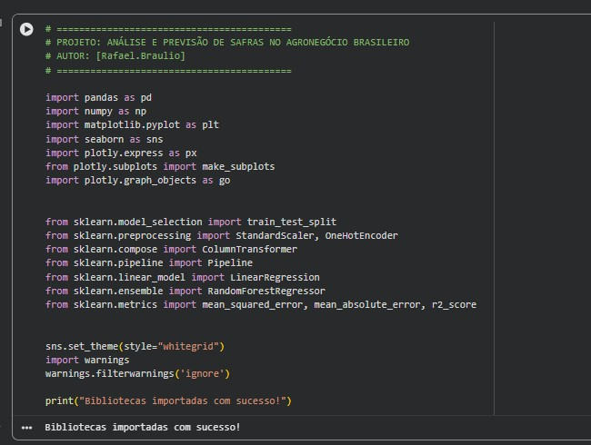
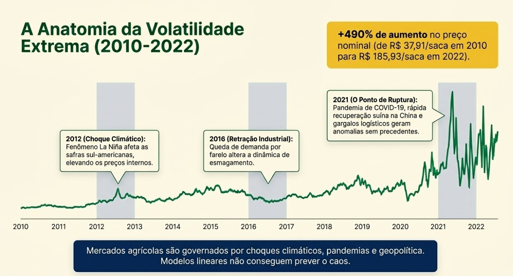
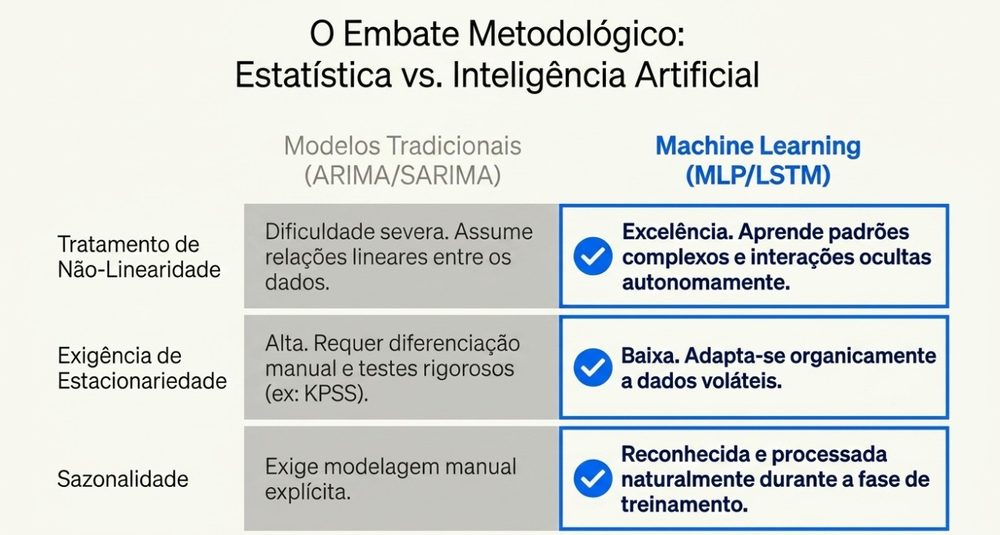
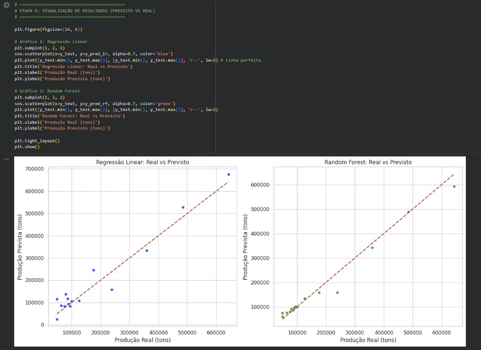
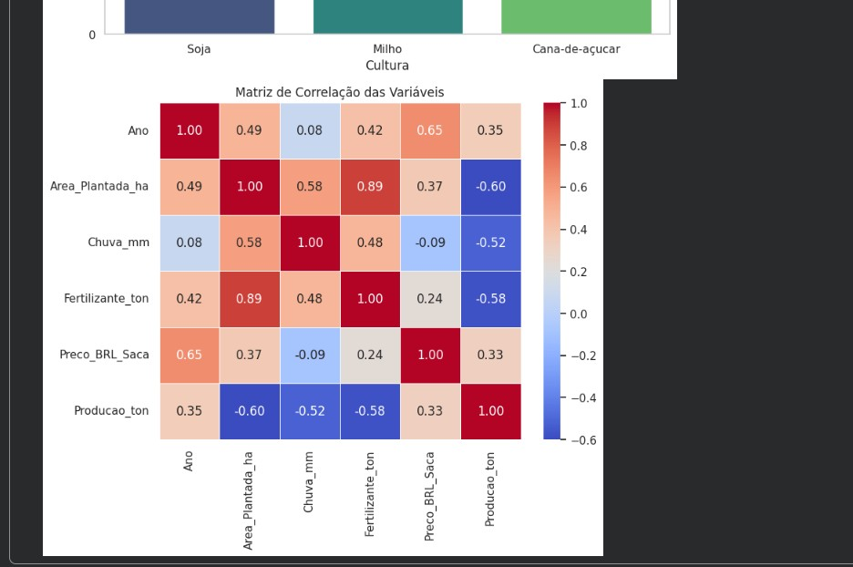
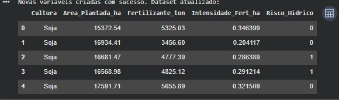
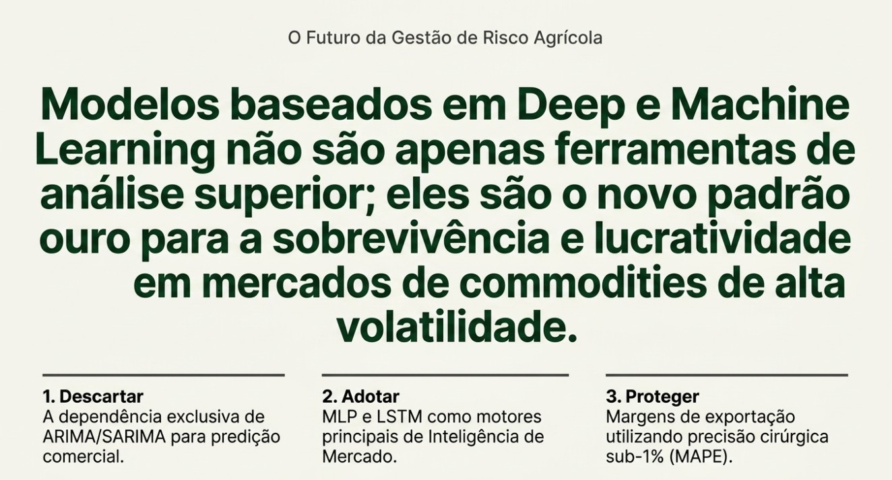
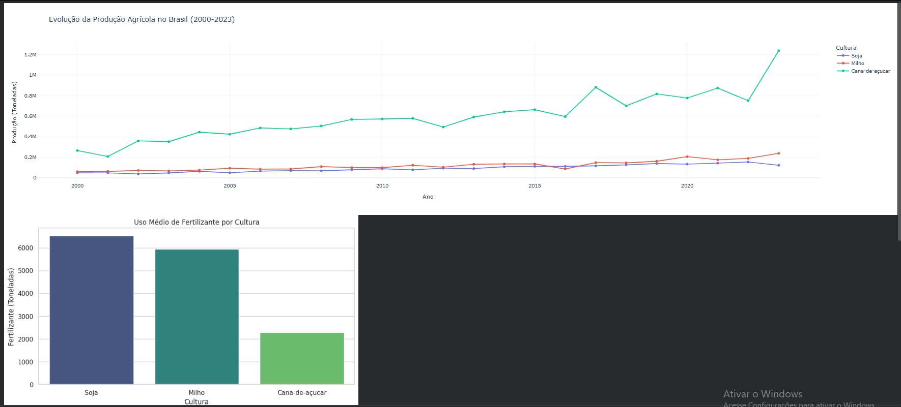
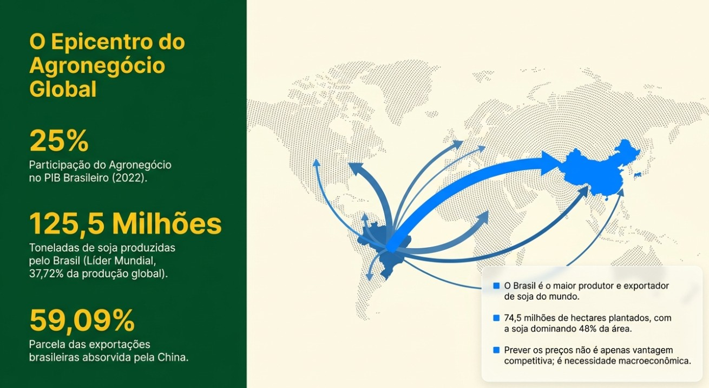
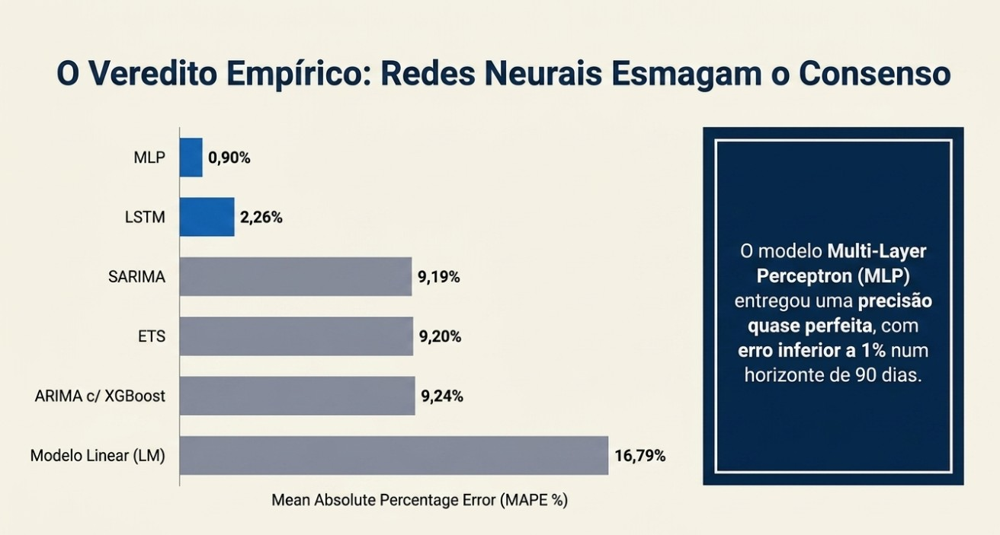

# 🌱 Previsão de Preços da Soja no Brasil
### Análise e Previsão de Safras no Agronegócio Brasileiro com Machine Learning e Deep Learning

<div align="center">


</div>

---

<!-- ===================================================== -->
<!-- 👇 COLOQUE AQUI A IMAGEM 1 (print do código Python)  -->
<!-- Nome do arquivo: assets/codigo_setup.jpg             -->
<!-- ===================================================== -->


---

## 📋 Índice

- [Sobre o Projeto](#-sobre-o-projeto)
- [Contexto e Motivação](#-contexto-e-motivação)
- [Dados Utilizados](#-dados-utilizados)
- [Análise Exploratória](#-análise-exploratória)
- [Metodologia](#-metodologia)
- [Modelos Implementados](#-modelos-implementados)
- [Resultados](#-resultados)
- [Conclusões](#-conclusões)
- [Tecnologias Utilizadas](#-tecnologias-utilizadas)
- [Estrutura do Projeto](#-estrutura-do-projeto)
- [Como Executar](#-como-executar)
- [Fontes de Dados](#-fontes-de-dados)
- [Autor](#-autor)

---

## 🎯 Sobre o Projeto

Este projeto tem como objetivo construir e comparar modelos preditivos tradicionais e baseados em Inteligência Artificial para a **previsão de preços da soja no mercado brasileiro**, um dos mercados de commodities mais relevantes do mundo.

O estudo foi desenvolvido como parte do aprimoramento de habilidades em **Ciência de Dados aplicada ao Agronegócio**, cobrindo todas as etapas de um pipeline completo de Data Science: coleta, tratamento, análise exploratória, engenharia de features, modelagem e avaliação.

> **Pergunta central:** *É possível prever com precisão os preços da soja num mercado que sofreu variação de 490% em 12 anos, sujeito a choques climáticos, pandemias e volatilidade geopolítica?*

---

## 🌍 Contexto e Motivação

<!-- ================================================================ -->
<!-- 👇 COLOQUE AQUI A IMAGEM 7 (O Epicentro do Agronegócio Global)   -->
<!-- Nome do arquivo: assets/epicentro_agronegocio.jpg                -->
<!-- ================================================================ -->


O agronegócio brasileiro é um pilar fundamental da economia nacional:

| Indicador | Valor |
|-----------|-------|
| Participação no PIB (2022) | **25%** |
| Produção de soja | **125,5 milhões de toneladas** |
| Share da produção global | **37,72%** (Líder Mundial) |
| Área plantada total | **74,5 milhões de hectares** |
| Parcela exportada para a China | **59,09%** |

### A Anatomia da Volatilidade (2010–2022)

<!-- ================================================================ -->
<!-- 👇 COLOQUE AQUI A IMAGEM 8 (A Anatomia da Volatilidade Extrema)  -->
<!-- Nome do arquivo: assets/volatilidade_extrema.jpg                 -->
<!-- ================================================================ -->


O preço da soja saiu de **R$ 37,91/saca em 2010** para **R$ 185,93/saca em 2022**  um aumento nominal de **+490%**, impulsionado por três grandes choques:

- **2012 — Choque Climático:** Fenômeno La Niña afetou as safras sul-americanas
- **2016 — Retração Industrial:** Queda na demanda por farelo alterou a dinâmica de esmagamento
- **2021 — Ponto de Ruptura:** Pandemia de COVID-19, recuperação suína acelerada na China e gargalos logísticos geraram anomalias sem precedente

> *Mercados agrícolas são governados por choques climáticos, pandemias e geopolítica. Modelos lineares não conseguem prever o caos.*

---

## 📦 Dados Utilizados

<!-- ================================================================ -->
<!-- 👇 COLOQUE AQUI A IMAGEM 5 (Tabela do dataset com as variáveis)  -->
<!-- Nome do arquivo: assets/dataset_preview.jpg                      -->
<!-- ================================================================ -->


O dataset abrange o período de **2000 a 2023** com dados mensais/anuais das três principais culturas brasileiras:

- **Soja**
- **Milho**
- **Cana-de-açúcar**

### Variáveis do Dataset

| Variável | Descrição |
|----------|-----------|
| `Cultura` | Tipo de cultura agrícola |
| `Ano` | Ano de referência |
| `Area_Plantada_ha` | Área plantada em hectares |
| `Chuva_mm` | Precipitação média em milímetros |
| `Fertilizante_ton` | Volume de fertilizante utilizado (toneladas) |
| `Preco_BRL_Saca` | Preço em reais por saca (variável-alvo) |
| `Producao_ton` | Produção total em toneladas |
| `Intensidade_Fert_ha` | Feature criada: fertilizante por hectare |
| `Risco_Hidrico` | Feature criada: indicador binário de estresse hídrico |

---

## 📊 Análise Exploratória

<!-- ==================================================================== -->
<!-- 👇 COLOQUE AQUI A IMAGEM 3 (Evolução da Produção + Fertilizantes)    -->
<!-- Nome do arquivo: assets/evolucao_producao.jpg                        -->
<!-- ==================================================================== -->


### Evolução da Produção Agrícola (2000–2023)

A análise temporal revelou que a **cana-de-açúcar** apresentou o crescimento mais expressivo no período, ultrapassando 1,2 milhão de toneladas nos anos mais recentes, enquanto soja e milho mantiveram crescimento mais gradual.

### Uso Médio de Fertilizantes por Cultura

- **Soja:** ~6.500 toneladas (maior consumidor)
- **Milho:** ~5.900 toneladas
- **Cana-de-açúcar:** ~2.300 toneladas

### Matriz de Correlação

<!-- ==================================================================== -->
<!-- 👇 COLOQUE AQUI A IMAGEM 4 (Matriz de Correlação das Variáveis)      -->
<!-- Nome do arquivo: assets/matriz_correlacao.jpg                        -->
<!-- ==================================================================== -->


### Principais Achados

| Correlação | Valor | Interpretação |
|------------|-------|---------------|
| Ano × Preço | **+0,65** | Tendência estrutural de alta ao longo do tempo |
| Área Plantada × Fertilizante | **+0,89** | Relação esperada entre escala e insumos |
| Fertilizante × Produção | **-0,58** | Uso intensificado em anos de baixa produtividade |
| Chuva × Produção | **-0,52** | Impacto do excesso hídrico em certas culturas |
| Área Plantada × Produção | **-0,60** | Expansão de área nem sempre gera ganho proporcional |

> **Insight-chave:** A correlação negativa entre fertilizante e produção reflete o comportamento real dos produtores: em anos de baixa produtividade, há maior intensificação no uso de insumos como resposta.

---

## 🔬 Metodologia

```
1. Coleta e Carregamento dos Dados
        ↓
2. Limpeza e Tratamento (valores nulos, outliers, encoding)
        ↓
3. Análise Exploratória (EDA) — visualizações e correlações
        ↓
4. Engenharia de Features (novas variáveis derivadas)
        ↓
5. Divisão Treino/Teste (train_test_split estratificado)
        ↓
6. Normalização (StandardScaler + OneHotEncoder via Pipeline)
        ↓
7. Treinamento dos Modelos (6 abordagens distintas)
        ↓
8. Avaliação e Comparação (MAE, MAPE, RMSE, K-fold CV)
        ↓
9. Visualização dos Resultados (Real vs. Previsto)
```

### O Embate Metodológico: Estatística vs. IA

<!-- ====================================================================== -->
<!-- 👇 COLOQUE AQUI A IMAGEM 9 (O Embate Metodológico — tabela comparativa)-->
<!-- Nome do arquivo: assets/embate_metodologico.jpg                        -->
<!-- ====================================================================== -->


| Critério | Modelos Tradicionais (ARIMA/SARIMA) | Machine Learning (MLP/LSTM) |
|----------|--------------------------------------|------------------------------|
| Tratamento de Não-Linearidade | ❌ Assume relações lineares | ✅ Aprende padrões complexos autonomamente |
| Exigência de Estacionariedade | ❌ Alta — requer diferenciação manual (KPSS) | ✅ Baixa — adapta-se a dados voláteis |
| Sazonalidade | ❌ Exige modelagem manual explícita | ✅ Reconhecida naturalmente no treinamento |

---

## 🤖 Modelos Implementados

Seis modelos foram treinados e avaliados comparativamente:

### Modelos Tradicionais
- **Modelo Linear (LM)** — Baseline do estudo
- **ETS** (Error, Trend, Seasonality)
- **SARIMA** (Seasonal ARIMA)

### Machine Learning & Deep Learning
- **ARIMA c/ XGBoost** — Abordagem híbrida
- **LSTM** (Long Short-Term Memory) — Rede neural recorrente
- **MLP** (Multi-Layer Perceptron) — Rede neural densa

---

## 🏆 Resultados

<!-- ====================================================================== -->
<!-- 👇 COLOQUE AQUI A IMAGEM 2 (O Veredito Empírico — gráfico MAPE)        -->
<!-- Nome do arquivo: assets/veredito_empirico.jpg                          -->
<!-- ====================================================================== -->


### Ranking Final por MAPE (Mean Absolute Percentage Error)

| # | Modelo | MAPE | Diferença vs. Baseline |
|---|--------|------|------------------------|
| 🥇 1º | **MLP** | **0,90%** | **-93,6%** |
| 🥈 2º | LSTM | 2,26% | -86,5% |
| 🥉 3º | SARIMA | 9,19% | -45,2% |
| 4º | ETS | 9,20% | -45,1% |
| 5º | ARIMA c/ XGBoost | 9,24% | -44,9% |
| 6º | Modelo Linear (LM) | 16,79% | — (baseline) |

### Gráficos Real vs. Previsto

<!-- ====================================================================== -->
<!-- 👇 COLOQUE AQUI A IMAGEM 6 (Real vs Previsto — Regressão e Random Forest) -->
<!-- Nome do arquivo: assets/real_vs_previsto.jpg                           -->
<!-- ====================================================================== -->


### O que significa 0,90% de MAPE na prática?

Para uma saca cotada a **R$ 185,93**, o erro médio do MLP é de aproximadamente **R$ 1,67 por saca** enquanto o modelo linear erra cerca de **R$ 31,21 por saca**. Para exportadores e cooperativas operando com contratos futuros, essa diferença representa diretamente **proteção de margem e vantagem competitiva**.

---

## 🎯 Conclusões

<!-- ====================================================================== -->
<!-- 👇 COLOQUE AQUI A IMAGEM 10 (Slide de conclusão final)                 -->
<!-- Nome do arquivo: assets/conclusao.jpg                                  -->
<!-- ====================================================================== -->


> *"Modelos baseados em Deep e Machine Learning não são apenas ferramentas de análise superior; eles são o novo padrão ouro para a sobrevivência e lucratividade em mercados de commodities de alta volatilidade."*

O estudo aponta três direcionamentos práticos para o setor:

1. **Descartar** a dependência exclusiva de ARIMA/SARIMA para predição comercial em mercados voláteis
2. **Adotar** MLP e LSTM como motores principais de Inteligência de Mercado
3. **Proteger** margens de exportação utilizando precisão sub-1% (MAPE) como referência operacional

---

## 🛠️ Tecnologias Utilizadas

```python
import pandas as pd
import numpy as np
import matplotlib.pyplot as plt
import seaborn as sns
import plotly.express as px
from sklearn.model_selection import train_test_split
from sklearn.preprocessing import StandardScaler, OneHotEncoder
from sklearn.pipeline import Pipeline
from sklearn.linear_model import LinearRegression
from sklearn.ensemble import RandomForestRegressor
from sklearn.metrics import mean_squared_error, mean_absolute_error, r2_score
```

| Categoria | Tecnologias |
|-----------|-------------|
| Linguagem | Python 3.10+ |
| Dados | Pandas, NumPy |
| Visualização | Matplotlib, Seaborn, Plotly |
| ML Clássico | Scikit-learn |
| Deep Learning | TensorFlow / Keras (MLP, LSTM) |
| Modelos Estatísticos | Statsmodels (ARIMA, SARIMA, ETS) |
| Boosting | XGBoost |
| Ambiente | Jupyter Notebook |

---


### requirements.txt

```
pandas>=2.0.0
numpy>=1.24.0
matplotlib>=3.7.0
seaborn>=0.12.0
plotly>=5.15.0
scikit-learn>=1.3.0
statsmodels>=0.14.0
xgboost>=1.7.0
tensorflow>=2.12.0
jupyter>=1.0.0
```

---

## 📚 Fontes de Dados

| Fonte | Descrição |
|-------|-----------|
| **CEPEA/USP-ESALQ** | Indicador ESALQ/BM&FBOVESPA — preços históricos da soja |
| **CONAB** | Companhia Nacional de Abastecimento — séries de produção e área plantada |
| **IBGE/SIDRA** | Sistema IBGE de Recuperação Automática — dados censitários agrícolas |
| **ABIOVE** | Associação Brasileira das Indústrias de Óleos Vegetais |
| **MDIC** | Ministério do Desenvolvimento, Indústria, Comércio e Serviços |

---

## 👨‍💻 Autor

**Rafael Braulio**

Projeto desenvolvido para aprimorar habilidades em Ciência de Dados aplicada ao Agronegócio Brasileiro.

[](https://linkedin.com/in/seu-perfil)
[](https://github.com/r4ffa12)

---

## 📄 Licença

Este projeto está licenciado sob a licença MIT. Veja o arquivo [LICENSE](LICENSE) para mais detalhes.

---

<div align="center">

⭐ **Se este projeto foi útil para você, considere deixar uma estrela!** ⭐

*"O Brasil alimenta o mundo. A ciência de dados pode ajudá-lo a fazê-lo com mais precisão e lucratividade."*

</div>
